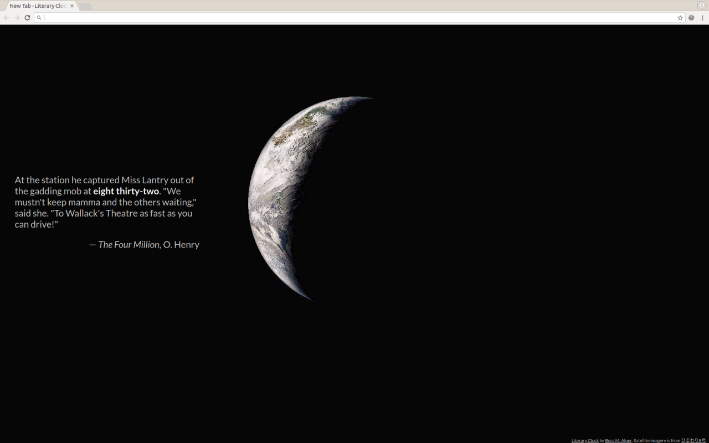

# Literary Clock

Shows time in quotes from literature, on a dark background featuring the
earth as it was ~12 hours ago (adjusted for your time-zone).

Get it for:
- [Firefox](https://addons.mozilla.org/en-US/firefox/addon/literary-clock/)
- [Chrome/Chromium](https://chrome.google.com/webstore/detail/literary-clock/klimjjoolmemiionkhfgaligdiioehkg)

## Acknowledgements:

- **Inspired by:**

  https://www.instructables.com/id/Literary-Clock-Made-From-E-reader/

- **Data from:**

  https://www.theguardian.com/books/table/2011/apr/21/literary-clock

- **Satellite imagery is provided by Japan Meteorological Agency:**

  https://www.data.jma.go.jp/mscweb/data/himawari/sat_img.php
